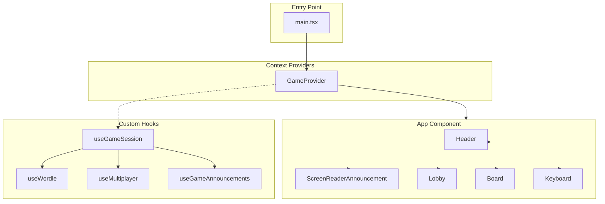
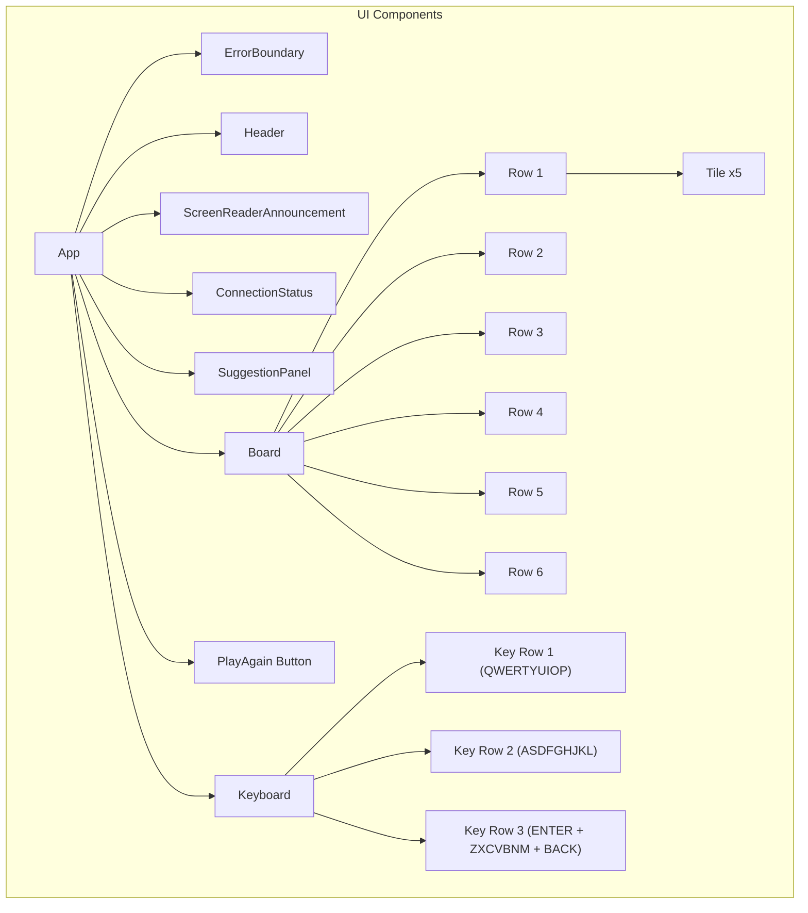
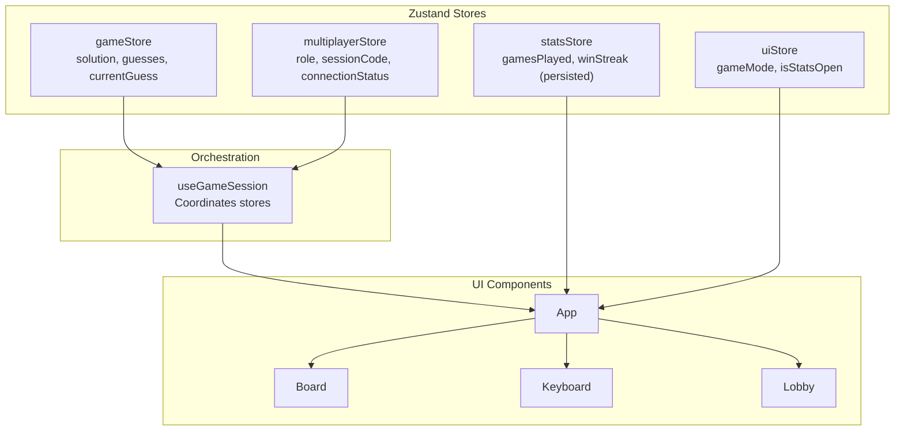
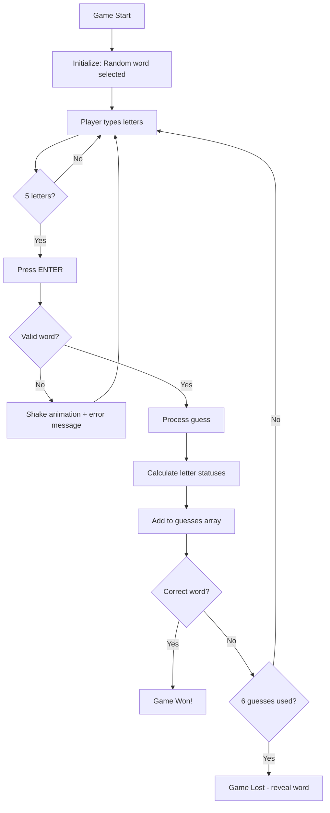
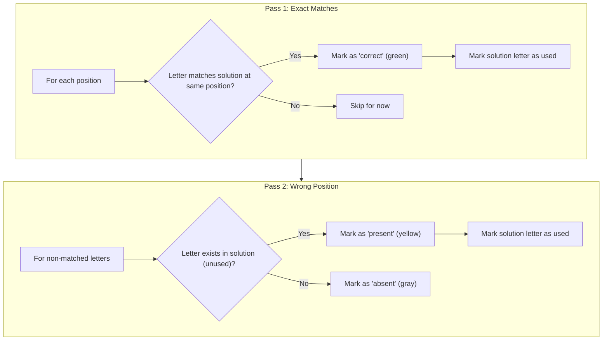
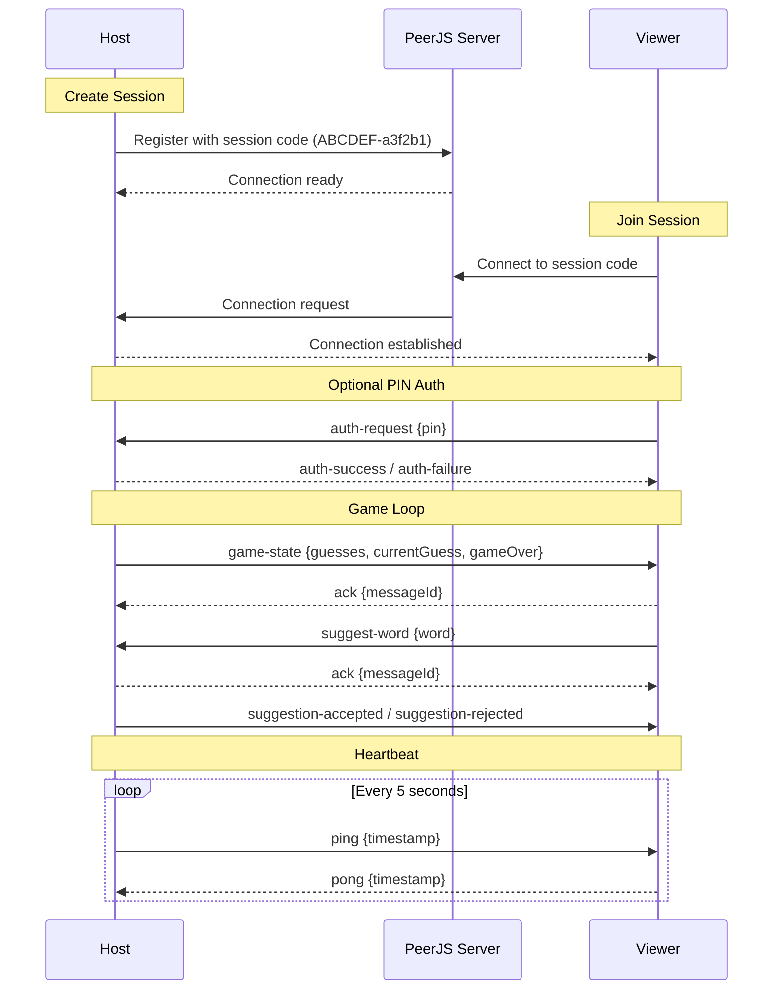
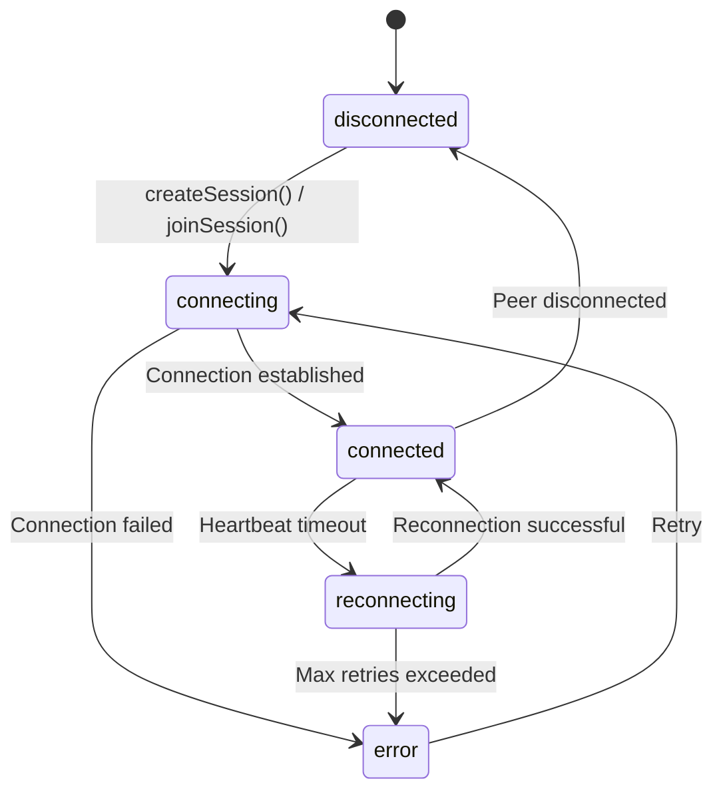
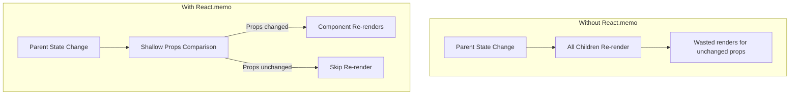

# Wordle

A React-based Wordle clone with real-time peer-to-peer multiplayer support, built with modern web technologies.

## Features

- **Solo Play**: Classic Wordle gameplay with random 5-letter words
- **Multiplayer Mode**: Real-time P2P collaboration via WebRTC
  - Host creates a game session with a unique code (format: `ABCDEF-a3f2b1`)
  - Share games via Copy Link or WhatsApp buttons
  - Join directly via URL: `?join=ABCDEF-a3f2b1`
  - Viewers can connect and suggest words
  - Optional PIN authentication for private sessions
  - Cryptographically secure session codes (~10 trillion combinations)
- **Progressive Web App**: Installable with offline support
- **Accessibility**: Screen reader support with ARIA live announcements
- **Performance Optimized**: React.memo on all components to prevent unnecessary re-renders

## Tech Stack

| Technology | Purpose |
|------------|---------|
| React 19 | UI framework with hooks |
| TypeScript | Type safety and IDE support |
| Vite | Build tool and dev server |
| Zustand | State management with selectors |
| PeerJS | P2P connections via WebRTC |
| Zod | Runtime message validation |
| Vitest | Unit testing framework |

## Getting Started

```bash
# Install dependencies
npm install

# Start development server
npm run dev

# Run tests
npm test

# Build for production
npm run build

# Deploy to GitHub Pages
npm run deploy
```

## Architecture Overview

### Application Structure



### Component Hierarchy



### Directory Structure

```
src/
├── components/           # React UI components
│   ├── Board.tsx        # Game board grid (6 rows)
│   ├── Row.tsx          # Single row of 5 tiles
│   ├── Tile.tsx         # Individual letter cell
│   ├── Keyboard.tsx     # On-screen keyboard
│   ├── Lobby.tsx        # Game mode selection
│   ├── ScreenReaderAnnouncement.tsx
│   └── ErrorBoundary.tsx
├── stores/              # Zustand state stores
│   ├── index.ts         # Store exports
│   ├── gameStore.ts     # Core game state
│   ├── multiplayerStore.ts # P2P connection state
│   ├── peerConnection.ts # Lazy-loaded PeerJS module
│   ├── statsStore.ts    # Statistics with persistence
│   └── uiStore.ts       # UI state (modals, game mode)
├── hooks/
│   ├── useGameSession.ts # Session orchestration
│   └── useGameAnnouncements.ts
├── data/
│   └── words.ts         # Word list (~1200 words)
├── test/
│   └── setup.ts         # Vitest configuration
├── types.ts             # TypeScript types & Zod schemas
├── App.tsx              # Main application component
└── main.tsx             # React entry point
```

## State Management

The application uses **Zustand** for state management, providing significant benefits over the previous React Context approach.

### Why Zustand?

| Benefit | Description |
|---------|-------------|
| **Fine-grained subscriptions** | Components only re-render when their specific state slice changes |
| **No Provider required** | Stores can be imported and used directly without wrapping the component tree |
| **Access outside React** | Use `store.getState()` in WebRTC callbacks, timeouts, etc. |
| **Built-in persistence** | The stats store uses `persist` middleware for automatic localStorage sync |
| **Simpler than Redux** | Minimal boilerplate, ~1KB bundle size |

### Store Architecture



### Store Overview

#### gameStore - Core Game Logic
```typescript
import { useGameStore } from './stores';

// Subscribe to specific slices (prevents unnecessary re-renders)
const guesses = useGameStore((s) => s.guesses);
const currentGuess = useGameStore((s) => s.currentGuess);
const gameOver = useGameStore((s) => s.gameOver);

// Actions
const submitGuess = useGameStore((s) => s.submitGuess);
const newGame = useGameStore((s) => s.newGame);
```

#### multiplayerStore - P2P Connection
```typescript
import { useMultiplayerStore } from './stores';

// State
const role = useMultiplayerStore((s) => s.role);
const sessionCode = useMultiplayerStore((s) => s.sessionCode);
const partnerConnected = useMultiplayerStore((s) => s.partnerConnected);

// Actions
const hostGame = useMultiplayerStore((s) => s.hostGame);
const joinGame = useMultiplayerStore((s) => s.joinGame);

// Access outside React (for WebRTC callbacks)
const state = useMultiplayerStore.getState();
```

#### statsStore - Persisted Statistics
```typescript
import { useStatsStore } from './stores';

// Auto-synced to localStorage via persist middleware
const stats = useStatsStore((s) => s.stats);
const recordGame = useStatsStore((s) => s.recordGame);
```

#### uiStore - UI State
```typescript
import { useUIStore } from './stores';

const gameMode = useUIStore((s) => s.gameMode);
const isStatsOpen = useUIStore((s) => s.isStatsOpen);
```

## Game Logic

### Core Game Flow



### Letter Status Algorithm

The game uses a two-pass algorithm to correctly handle duplicate letters:



**Example: Guessing "PAPAL" when solution is "APPLE"**

| Position | Guess | Solution | Pass 1 | Pass 2 | Final |
|----------|-------|----------|--------|--------|-------|
| 0 | P | A | - | P exists at pos 1 | present (yellow) |
| 1 | A | P | - | A exists at pos 0 | present (yellow) |
| 2 | P | P | Match! | - | correct (green) |
| 3 | A | L | - | A at pos 4 unused | present (yellow) |
| 4 | L | E | - | L at pos 3 used | absent (gray) |

## Multiplayer System

### P2P Architecture

The multiplayer system uses PeerJS for WebRTC-based peer-to-peer connections.

### Session Code Format

Session codes use a secure two-part format: `{readable}-{secret}`

| Part | Format | Example | Purpose |
|------|--------|---------|---------|
| Readable | 6 uppercase chars | `ABCDEF` | Human-friendly sharing |
| Secret | 6 lowercase hex | `a3f2b1` | Brute-force protection |

**Security:** This format provides ~10 trillion possible combinations (29^6 × 16^6), making it impractical for attackers to guess active session codes.

### Sharing Options

Hosts can share their game session in three ways:

1. **Manual code entry**: Share the code verbally or via text; viewers enter it manually
2. **Copy Link**: Copies a URL with `?join=CODE` parameter to clipboard
3. **WhatsApp**: Opens WhatsApp with a pre-filled message containing the join link

When a viewer opens a share link, the join form is automatically displayed with the code pre-filled.



### Message Types

All messages are validated at runtime using Zod schemas:

| Message Type | Direction | Purpose |
|--------------|-----------|---------|
| `game-state` | Host → Viewer | Sync game state (guesses, currentGuess, gameOver) |
| `suggest-word` | Viewer → Host | Submit word suggestion |
| `suggestion-accepted` | Host → Viewer | Accept viewer's suggestion |
| `suggestion-rejected` | Host → Viewer | Reject viewer's suggestion |
| `auth-request` | Viewer → Host | Send PIN for authentication |
| `auth-success/failure` | Host → Viewer | Authentication result |
| `ping/pong` | Both | Heartbeat for connection health |
| `ack` | Both | Message acknowledgment |

### Connection Resilience



**Retry Strategy:**
- Initial delay: 1 second
- Max delay: 16 seconds
- Formula: `min(1000 * 2^attempt, 16000)`
- Max attempts: 5

## Performance Optimizations

### React.memo Usage

All UI components are wrapped with `React.memo` to prevent unnecessary re-renders:



| Component | Why Memo is Important |
|-----------|----------------------|
| `Board` | Contains 30 tiles; prevents full grid re-render when only currentGuess changes |
| `Row` | Previous rows shouldn't re-render when typing new guess |
| `Tile` | Most granular component; submitted tiles never need to re-render |
| `Keyboard` | 30 key buttons; only re-render when keyboard status changes |
| `Lobby` | Form inputs shouldn't trigger re-renders from game state changes |
| `ScreenReaderAnnouncement` | Minimal DOM updates for accessibility |

### Lazy Loading (Code Splitting)

PeerJS (~100KB) is dynamically imported only when multiplayer features are used:

```typescript
// peerConnection.ts
export const loadPeerJS = async () => {
  if (PeerClass) return PeerClass;  // Return cached module
  const module = await import('peerjs');
  PeerClass = module.default;
  return PeerClass;
};

// multiplayerStore.ts
const hostGame = () => {
  set({ connectionStatus: 'connecting' });  // UI updates immediately
  loadPeerJS().then((Peer) => {
    // PeerJS loads on demand, then connection starts
    const peer = new Peer(peerId);
  });
};
```

**Bundle Impact:**

| Bundle | Size | When Loaded |
|--------|------|-------------|
| Main | 308 KB (94 KB gzipped) | Initial page load |
| PeerJS chunk | 116 KB (32 KB gzipped) | On "Host Game" or "Join Game" |

This saves ~85KB for users who only play solo games.

### Other Optimizations

1. **useCallback**: All handler functions are memoized to maintain reference equality
   ```typescript
   const handleKeyPress = useCallback((key: string) => {
     // ...
   }, [dependencies]);
   ```

2. **useRef for Non-Render State**: PeerJS connections and reconnection state use refs to avoid re-renders
   ```typescript
   const peerRef = useRef<Peer | null>(null);
   const reconnectAttempts = useRef(0);
   ```

3. **Immutable Updates**: All state updates create new objects/arrays for efficient React diffing
   ```typescript
   setGuesses(prev => [...prev, newGuess]);
   ```

## Testing

### Test Setup

Tests use Vitest with React Testing Library:

```bash
# Run tests once
npm test

# Run tests in watch mode
npm run test:watch
```

### Testing Strategy

The project uses a comprehensive testing approach with **240 tests** across 11 test files:

| Category | Tests | Coverage |
|----------|-------|----------|
| **Store Tests** | 88 | All Zustand stores (game, multiplayer, stats, UI) |
| **Component Tests** | 82 | Tile, Row, Board, Keyboard, Stats components |
| **Hook Tests** | 41 | useGameSession orchestration hook |
| **Integration Tests** | 29 | End-to-end user flows |

### Test Categories

#### 1. Store Tests (`src/stores/*.test.ts`)

Unit tests for Zustand stores covering:
- **gameStore**: Letter status algorithm, guess submission, win/lose conditions, duplicate letter handling
- **multiplayerStore**: P2P connection flow, message handling, authentication, reconnection
- **statsStore**: Game recording, streak tracking, persistence
- **uiStore**: Game mode, modal state, theme management

#### 2. Component Tests (`src/components/*.test.tsx`)

UI component tests covering:
- **Tile**: Empty, filled, and status states; animation delays; accessibility labels
- **Row**: Current input, submitted guesses, shake animation
- **Board**: Grid rendering, guess display, accessibility
- **Keyboard**: Key rendering, status colors, click handling, disabled state
- **Stats**: Statistics display, distribution bars, modal behavior

#### 3. Hook Tests (`src/hooks/*.test.ts`)

Tests for the main orchestration hook:
- Initial state values
- Game actions (play solo, host, join, leave, new game)
- Keyboard handling for host and viewer modes
- Suggestion workflow (send, accept, reject)
- Game state synchronization

#### 4. Integration Tests (`src/integration/*.test.ts`)

Lightweight end-to-end tests simulating real user flows:

**Solo Game Flow:**
- Complete winning/losing games
- Letter status tracking across guesses
- Invalid word rejection
- New game after completion

**Multiplayer Flow:**
- Host/join with optional PIN
- Suggestion handling (viewer types, host accepts/rejects)
- Connection status display
- Session leaving and cleanup

**Statistics Flow:**
- Recording wins/losses
- Guess distribution tracking
- Streak management
- Stats persistence and reset

### Example Test

```typescript
it('should handle duplicate letters correctly', () => {
  const { result } = renderHook(() => useGameSession());

  act(() => result.current.handlePlaySolo());

  // Guess PAPER against solution APPLE
  submitWord(result, 'PAPER');

  // P(present), A(present), P(correct), E(correct), R(absent)
  expect(result.current.guesses[0].status).toEqual([
    'present', 'present', 'correct', 'correct', 'absent'
  ]);
});
```

## Accessibility

The application includes several accessibility features:

- **Screen Reader Announcements**: ARIA live regions announce game events
- **Keyboard Navigation**: Full keyboard support for gameplay
- **Semantic HTML**: Proper heading hierarchy and button elements
- **Color Contrast**: High contrast colors for letter statuses

## PWA Support

The application is a Progressive Web App with:

- **manifest.json**: App metadata, icons, and display settings
- **Service Worker**: Offline caching and background sync
- **Installable**: Can be added to home screen on mobile devices

## Configuration

### TypeScript

Strict type checking is enabled with additional safety options:

```json
{
  "compilerOptions": {
    "strict": true,
    "noUnusedLocals": true,
    "noUnusedParameters": true,
    "noUncheckedIndexedAccess": true,
    "exactOptionalPropertyTypes": true
  }
}
```

### ESLint

The project uses TypeScript-aware ESLint rules with React hooks plugin:

```javascript
// Key rules enforced:
- react-hooks/rules-of-hooks    // Enforce hook rules
- react-hooks/exhaustive-deps   // Verify effect dependencies
- typescript-eslint/recommended // TypeScript best practices
```

## License

MIT
